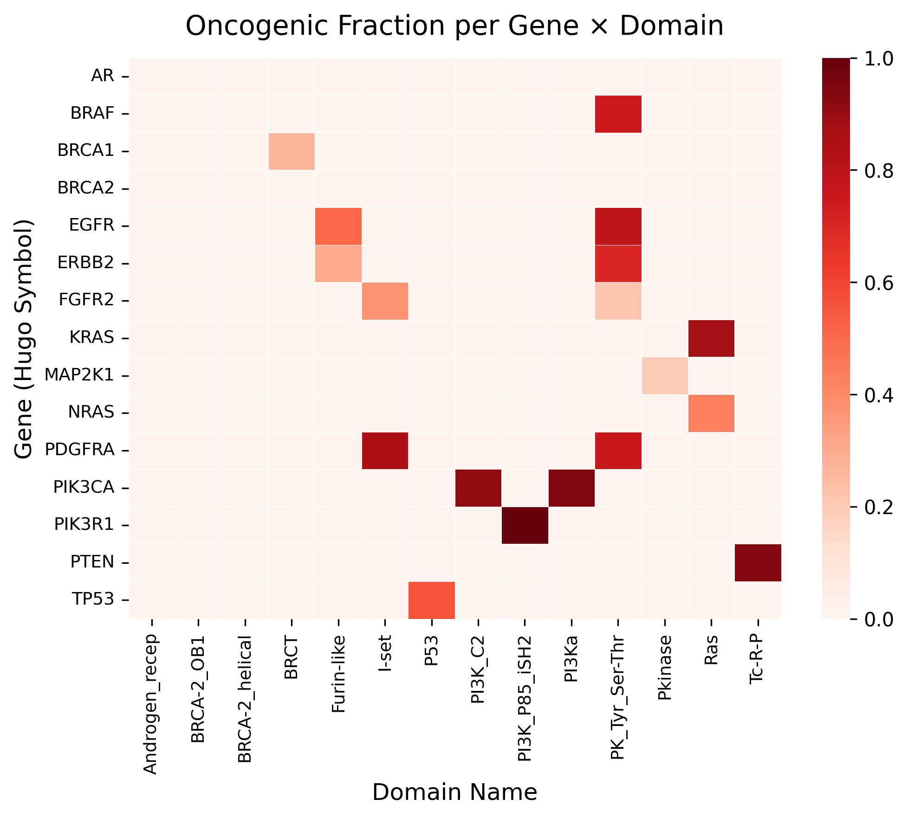

# Data Exploration Cancer Variants 👩🏽‍🔬

Scripts to explore, visualize and perform statistics on somatic cancer variants and evidence for oncogenicity classification. 
Each script contains further explanations on purpose and outputs.

<figure>
  <p align="center">
    
  </p>
  <figcaption align="center">
    <b>Oncogenic fraction of somatic variants per gene and protein domain.</b> 
    Color intensity reflects the proportion of variants classified as oncogenic within each gene–domain combination.
  </figcaption>
</figure>

The classification evidence includes: 
- Population frequencies from gnomAD
- Cancer mutation hotspots from cancerhotspots.org
- Protein domain annotations from Pfam
- Functional site annotations from UniProt
- Distance to known pathogenic germline variants from ClinVar 
- Functional score assays from MaveDB 
- Null variants in Tumor Suppressor genes 

## Requirements 💻
- Python 3.10+

## Setup Instructions 🔧

1. **Clone the repository:**
```bash
git clone https://github.com/anekleiven/explore_cancer_variants.git
cd explore_cancer_variants 
``` 

2. **Create Virtual Environment:**
`python -m venv .venv`
`. .venv/bin/activate`

3. **Install Python Requirements:**
`pip install -r requirements.txt`


## Exploratory Analysis Scripts

These scripts explore the prevalence of oncogenicity-associated features across oncogenic and neutral variant classes.

| Script | Description |
|---|---|
| `oncogenicity.py` | Class distribution of oncogenicity labels in the dataset |
| `top_genes.py` | Identification of top mutated genes across oncogenicity classes |
| `gnomAD_freq.py` | gnomAD allele frequency distributions for oncogenic and likely neutral variants |
| `cancerhotspots.py` | Enrichment of oncogenic and likely neutral variants in cancer mutation hotspots |
| `protein_domains.py` | Distribution of variants across annotated Pfam protein domains |
| `functional_sites.py` | Overlap of variants with UniProt functional protein sites |
| `germline_proximity.py` | Proximity analysis to known pathogenic germline variants |
| `neutral_dataset_clinvar.py` | Construction of a neutral variant dataset from ClinVar germline entries |
| `maves.py` | Analysis of MaveDB functional scores across oncogenicity classes |
| `tsg_og.py` | Variant distribution in oncogenes and tumor suppressor genes, including null variant visualization |

## Statistics Scripts

These scripts perform statistical comparisons between oncogenic and neutral variant classes using shared utility functions.

| Script | Description |
|---|---|
| `stats_function.py` | Shared statistical utility functions: Mann-Whitney U, Chi-Square, Fisher's exact test, and effect sizes |
| `stats_all_variants.py` | Statistical analysis across all variants |
| `stats_top_genes.py` | Statistical comparisons across top mutated genes |
| `stats_protein_domains.py` | Statistical analysis of variant distribution in protein domains |
| `stats_func_sites.py` | Statistical analysis of variant overlap with functional sites |
| `stats_germline_proximity.py` | Statistical analysis of distances to pathogenic germline variants |
| `stats_maves.py` | Statistical analysis of MaveDB functional scores |


## Recommended Sources 🛜

- AACR Project GENIE: https://www.aacr.org/professionals/research/aacr-project-genie/
- OncoKB: https://www.oncokb.org


